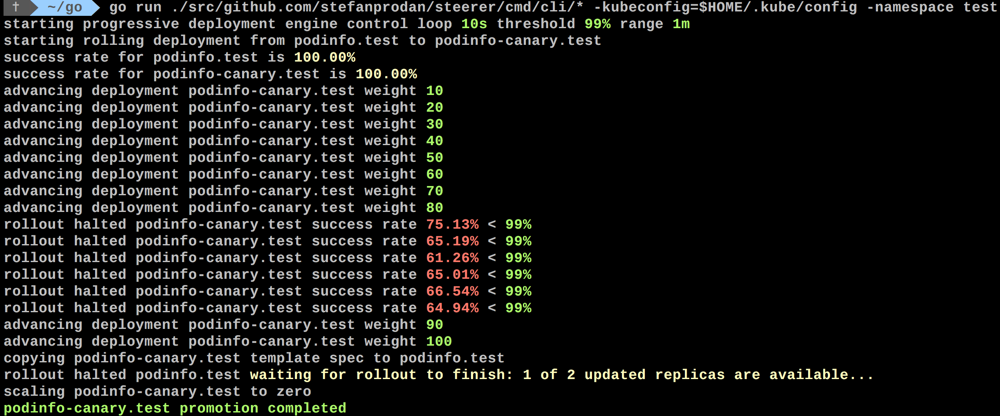

# steerer

Istio progressive rollout gated by Prometheus HTTP success rate metric

### Usage

Create a test namespace:

```bash
kubectl apply -f ./artifacts/namespace/
```

Create GA and canary deployments, services, hpa and Istio virtual service:

```bash
kubectl apply -f ./artifacts/workloads/
```

Rollout:



Rollout flow:
* scan namespace for deployments marked for rollout 
* scan namespace for a corresponding canary deployment (`-canary` prefix)
* check Istio virtual service routes are mapped to GA and canary ClusterIP services
* check GA and canary deployments status (halt rollout if a rolling update is underway or if pods are unhealthy)
* increase canary traffic weight percentage by 10%
* check canary HTTP success rate (halt rollout if percentage is under the specified threshold)
* advance canary traffic wight by 10% till it reaches 100% 
    * halt rollout while canary success rate is under the threshold
    * halt rollout if the GA or canary deployment becomes unhealthy 
    * halt rollout while canary deployment is being scaled up/down by HPA
* promote canary to GA (copy canary deployment spec template over GA)
* wait for GA rolling update to finish
* route all traffic to GA
* scale to zero the canary deployment
* mark rollout deployment as finished
* wait for the canary deployment to be updated (revision bump) and start over

HTTP success rate query:

```sql
sum(
    rate(
        istio_requests_total{
          reporter="destination",
          destination_workload_namespace=~"$namespace",
          destination_workload=~"$workload",
          response_code!~"5.*"
        }[$interval]
    )
) 
/ 
sum(
    rate(
        istio_requests_total{
          reporter="destination",
          destination_workload_namespace=~"$namespace",
          destination_workload=~"$workload"
        }[$interval]
    )
)
```


